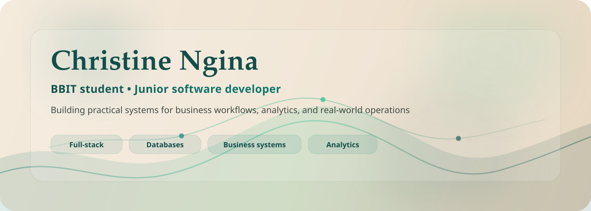

# Christine Ngina

**Bachelor of Business and Information Technology student at Strathmore University | Junior software developer | Alliance Girls High School alumna**

I build practical web systems with a focus on clean interfaces, backend logic, and useful data handling. I am pursuing a Bachelor of Business and Information Technology at Strathmore University and completed my KCSE at Alliance Girls High School. My work is geared toward real business workflows and internship-ready technical skills.

## Education

- Strathmore University - Bachelor of Business and Information Technology, 2024 - Present
- Alliance Girls High School - KCSE, 2020 - 2023

## Current Focus

- Full-stack web development
- Backend systems and APIs
- Database-driven systems
- Business information systems
- Dashboards, reporting, and workflow tools

## Current Project

**Enterprise Procurement Intelligence System**

## Selected Work

| Project | Focus |
| --- | --- |
| **MarketSync** | Market synchronization and B2B booking |
| **Student Study Hub** | Student productivity and study support |
| **Event Management System** | Event planning and coordination |

## Toolbox

| Area | Stack |
| --- | --- |
| **Languages** | HTML, CSS, JavaScript, TypeScript, PHP, Java, Python, C++, SQL, Bash, JSON |
| **Frontend** | React, Next.js, responsive design, component-based UI, state management |
| **Backend** | Node.js, REST APIs, authentication, authorization, server-side logic, email workflows |
| **Databases** | PostgreSQL, database design, schema modelling, query writing, indexing, normalization, migrations |
| **Engineering** | API integration, role-based access control, validation, reporting, analytics, documentation |
| **Tools** | Git, GitHub, Docker, Docker Compose, Linux command line basics, debugging, version control workflows |

## What I Build Best

- Business systems
- Reporting dashboards
- Approval and workflow tools
- Database-backed web applications

## GitHub Stats

## Contact

- Email: christyngumbu@gmail.com
- GitHub: [nginachris](https://github.com/nginachris)
